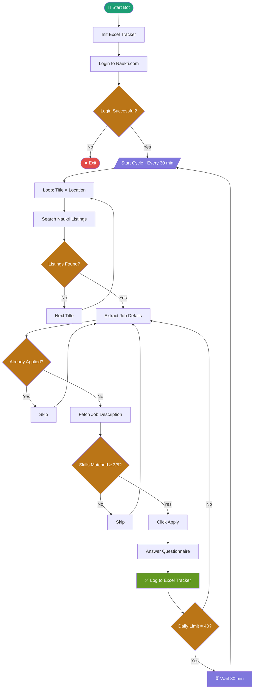

<<<<<<< HEAD
# 🤖 Naukri Job Application Automation Bot


> Automatically search, match, and apply for jobs on Naukri.com —
> built with Python, Selenium, and OpenPyXL.

---

## 🎯 What This Does

Most job seekers spend 2–3 hours daily manually applying on Naukri.
This bot does it for you — intelligently.

- 🔍 Searches across multiple job titles and locations
- 🧠 Reads every JD and matches against your core skills
- ✅ Only applies if ≥ 3 of your skills appear in the Job Description
- 📝 Auto-fills Yes/No questions and open-ended text boxes
- 📊 Logs every application into a 3-sheet Excel tracker
- 🔁 Reruns automatically every 30 minutes
- 🛡️ Caps at 40 applications/day to avoid account flagging

---

## 🔄 How It Works — Bot Flowchart

> The bot runs automatically every 30 minutes, searches across
> 8 job titles in Bengaluru & Hyderabad, reads every job description,
> matches your core skills, and only applies when ≥ 3 of 5 match.



---

## 📁 Project Structure

```
naukri-job-bot/
├── naukri_automation.py        # Main bot script
├── test_naukri_login.py        # Login selector diagnostic
├── test_jd.py                  # JD selector diagnostic
├── Naukri_Job_Tracker.xlsx     # Sample Excel log
├── naukri_run.log              # Runtime log file
├── screenshots/
│   ├── terminal_output.png
│   ├── application_log.png
│   ├── dashboard.png
│   └── questionnaire_sheet.png
├── .gitignore
├── LICENSE
└── README.md
```

---

## 🛠️ Tech Stack

| Tool               | Purpose                          |
|--------------------|----------------------------------|
| Python 3.8+        | Core language                    |
| Selenium 4.x       | Browser automation               |
| ChromeDriver       | Chrome control via WebDriver     |
| OpenPyXL           | Excel log generation             |
| webdriver-manager  | Auto ChromeDriver management     |

---

## ⚙️ Setup & Usage

### 1. Install dependencies

```bash
pip install selenium webdriver-manager openpyxl
```

### 2. Configure your profile

Open `naukri_automation.py` and edit the CONFIG block at the top:

```python
CONFIG = {
    "email": "your_naukri_email",
    "password": "your_naukri_password",
    "core_skills": [
        "ServiceNow", "ITIL", "Windows",
        "Troubleshooting", "IT Support"
    ],
    "min_skill_match": 3,
    "locations": ["Bengaluru", "Hyderabad"],
    "max_applications_per_day": 40,
}
```

### 3. Run the bot

```bash
py naukri_automation.py
```

### 4. Expected output

```
📋 Naukri Job Application Bot — Veerendra K
📍 Locations: Bengaluru, Hyderabad
🎯 Core Skills Required (≥3 of 5): ServiceNow, ITIL, Windows, Troubleshooting, IT Support
📊 Max Applications/Day: 40
🔁 Search Interval: every 30 minutes

🔍 Searching: IT Support Engineer in Bengaluru
  Found 20 listings.
  🎯 Match (4 skills: Windows, ITIL, Troubleshooting, IT Support): Infosys — IT Support Engineer
  ✅ Applied: Infosys — IT Support Engineer
  ⏭  Skipped (2/3 skills): XYZ Corp — Data Analyst
```

---

## 📊 Excel Tracker — 3 Sheets

| Sheet                    | Contents                                                  |
|--------------------------|-----------------------------------------------------------|
| Application Log          | Date, Company, Title, Location, Skills, Link, Status      |
| Dashboard                | Live counts — Applied, Interviews, Offers, Limit remaining|
| Questionnaire Answers    | Pre-written answers ready to copy-paste                   |

---

## 🧠 Skill Matching Logic

The bot fetches the full Job Description text and checks how many
of your core skills appear. It only applies if the match count
meets your minimum threshold (default: 3 out of 5).

```python
core_skills = [
    "ServiceNow", "ITIL", "Windows",
    "Troubleshooting", "IT Support"
]
```

**Example decisions:**

```
🎯 Match (4 skills) → Infosys — IT Support Specialist     ✅ Applied
⏭  Skipped (1/3)   → XYZ Corp — Data Analyst              ❌ Skipped
```

---

## 💡 Why I Built This

We're in the AI and automation era — yet most job seekers still
apply manually, one click at a time. This project was my answer
to that. It's my first automation project, and it completely
changed how I think about productivity and job searching.

Why spend 3 hours applying manually when your code can do it smarter?

---

## 🤝 Contributing

Open to suggestions, improvements, and pull requests!
If you adapt this for LinkedIn, Indeed, or Internshala —
I'd love to collaborate.

---

## 📬 Connect

- [LinkedIn](https://www.linkedin.com/in/veerendrasagar)
- [Email](veerendrasagar.k23@gmail.com)

---

⭐ If this helped or inspired you, please **star the repo** and share
it with anyone grinding through job applications manually!
=======
# naukri-job-automation
Automatically search, match, and apply for jobs on Naukri.com
>>>>>>> a9e3a0d12aa5cdef9567023cf0d4000e66300aea
